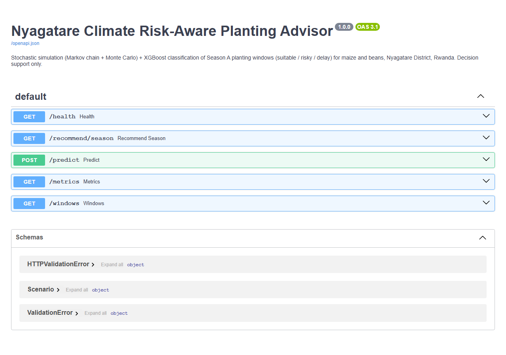

# Climate Risk-Aware Planting Recommendation Model

**Stochastic simulation (Markov chain + Monte Carlo) + machine learning for
risk-aware maize & beans planting-window advice, Season A (Sep–Dec),
Nyagatare District, Rwanda.**


> **GitHub repo:** https://github.com/alicemukarwema/climate_risk_planting_decision_model
> **Demo video:** https://drive.google.com/file/d/1trDtNwObJ4aEENOfXE2WRl2Xh8jfeOKN/view?usp=sharing
---

## 1 · Description

Existing climate services (Meteo Rwanda / ENACTS) publish rainfall and
temperature data, but a farmer's question is more concrete: *plant now or
delay? Maize or beans? And how risky is it?* This Project answers that question
with a deployed model that returns the **recommended crop, planting window,
risk label (suitable/risky / delay), class probabilities, confidence,
stochastic risk components, and a plain-language explanation.

**Pipeline**

```
real ENACTS dekadal data (1981–2023 rainfall, 1961–2021 tmax, 1961–2016 tmin)
        │
        ▼
feature engineering ── onset, cumulative rain, dry spells, anomalies
        │
        ▼
stochastic risk layer ── 2-state Markov chain (month-specific transitions)
        │                + Monte Carlo: 1,000 simulated crop cycles per window
        ▼                → P(sufficient rain), P(dry spell), P(heat), risk score
ML classification ── rule baseline vs Decision Trees vs XGBoost
        │            labels: suitable/risky / delay (from observed outcomes)
        ▼
FastAPI service ── Swagger UI + JSON API + optional web UI + prediction logging
```

### Initial results (temporal hold-out: train 1982–2014, test 2015–2023)

| model | macro F1 | balanced accuracy | Brier score ↓ |
|---|---|---|---|
| Rule-based baseline | 0.320 | 0.340 | 1.068 |
| Decision Tree — raw climate | 0.463 | 0.542 | 0.923 |
| Decision Tree — stochastic risk | 0.526 | 0.632 | 0.937 |
| **XGBoost — all features (selected)** | **0.642** | **0.706** | **0.556** |

The stochastic risk features lift the interpretable Decision Tree (RQ3 ✅),
and XGBoost wins every metric with by far the best-calibrated probabilities
(RQ4 ✅) — Calibration is the heart of *risk-aware* advice.

### Dekadal Data
 **publicly downloadable** ENACTS export
from Meteo Rwanda's Maproom/Data portal is **dekadal** (10-day totals), so the
whole pipeline operates at dekad resolution. Every daily concept is mapped
explicitly: wet *day* (≥1 mm) → wet *dekad* (≥20 mm ≈ 2 mm/day at district
average), Markov transitions between dekads, 30-day establishment = 3 dekads,
and crop cycles of 7 dekads (beans) / 12 dekads (maize). Daily station data
from Meteo Rwanda would be a drop-in upgrade — only `src/data_loader.py` and
the thresholds in `src/crops.py` change.

### Data Source

The climate records used in this project are exported from the Rwanda Meteorology
Agency / Meteo Rwanda ENACTS services for the Nyagatare area. Because the
interactive Maproom/Data portals can redirect, timeout, or require manual
navigation, the exact extracts used for this project are committed locally:

| file | role |
|---|---|
| `data/nyagatare_rainfall_dekadal.csv` | dekadal rainfall, 1981-2023 |
| `data/nyagatare_tmax.csv` | dekadal maximum temperature, 1961-2021 |
| `data/nyagatare_tmin.csv` | dekadal minimum temperature, 1961-2016 |

Official source agency: [Rwanda Meteorology Agency / Meteo Rwanda](https://www.meteorwanda.gov.rw/home).
From that site, use the **Maproom** or **Data** links to re-export updated
records for the Nyagatare box.

---

## 2 · How to set up the environment and run the project

Requires **Python 3.11+**.

```bash
git clone https://github.com/alicemukarwema/climate_risk_planting_decision_model
cd climate_risk_planting_model

python -m venv .venv
.venv\Scripts\activate              # Windows   (Linux/Mac: source .venv/bin/activate)
pip install -r requirements.txt      # API + model runtime dependencies

# 1. train: features → simulation → labels → 4-model comparison → artefacts
python train.py

# 2. Test the deployed API behaviour
python tests/test_api.py

# 3. Serve the API locally
uvicorn app:app --reload --port 8000
```

Then open:

| URL | What you get |
|---|---|
| http://localhost:8000/docs | **Swagger UI** — main API demo for the rubric deployment option |
| http://localhost:8000/ | Redirects to Swagger UI |
| http://localhost:8000/recommend/season | Ranked crop × window table (JSON) |
| http://localhost:8000/metrics | Full model-comparison report (JSON) |

The ML notebook (data visualization, architecture, metrics) is at
[`notebooks/nyagatare_model.ipynb`](notebooks/nyagatare_model.ipynb) 

```bash
pip install -r requirements-dev.txt
python -m nbconvert --to notebook --execute --inplace notebooks/nyagatare_model.ipynb
```

### Example API call

```bash
curl -X POST http://localhost:8000/predict \
  -H "Content-Type: application/json" \
  -d '{"crop": "auto", "last3_rain": 20, "pre_tmax_anom": 1.5}'
```

→ compares both crops across all 9 candidate windows under a dry + hot
scenario and returns the best risk-aware option with explanation. Predictions
are logged at runtime to `data/prediction_logs.csv` for deployment testing.

---

## 3 · Designs (interfaces)

The MVP deployment interface is the FastAPI Swagger UI. The optional web page
is kept only as a simple local helper; the API is the main demo surface.



Key notebook figures live in [`docs/figures/`](docs/figures/) — annual rainfall
cycle, Markov transition probabilities, and Monte Carlo validation against the
observed cycle-rainfall distribution, risk-by-window profiles, and confusion
matrices, and feature importance.

---

## 4 · Project structure

```
├── app.py                  FastAPI serving layer (objective 6)
├── train.py                end-to-end training entrypoint
├── src/
│   ├── data_loader.py      parse real ENACTS exports, merge rain + tmax + tmin
│   ├── crops.py            documented crop requirements & thresholds (Table 4)
│   ├── features.py         pre-window features + observed outcomes (objective 2)
│   ├── simulate.py         Markov chain + Monte Carlo risk layer (objective 3)
│   ├── dataset.py          (year × window × crop) ML table + labels (objective 4)
│   ├── model.py            4-model comparison + metrics + artefacts (objective 5)
│   ├── recommend.py        risk output formatting & ranking
│   └── service.py          advisory service used by the API
├── notebooks/nyagatare_model.ipynb     ML-track notebook (executed)
├── tests/test_api.py       deployment test suite (11 checks)
├── Dockerfile              container deployment entrypoint
├── render.yaml             Render deployment config
├── Procfile                Railway/Render-style process command
├── data/                   ENACTS CSVs + exported proposal tables
├── models/                 xgb_planting_risk.json + report.json
├── static/index.html       optional web UI
└── docs/                   screenshots, figures, TESTING.md, feedback_form.md

## 5 · Deployment plan

**Now (MVP):** FastAPI service with Swagger UI — sufficient for
supervisor/agronomist testing per the proposal's deployment scope. The custom
HTML page is optional; the API and Swagger UI are the primary demo surface.

**Deploy on Render / Railway:**
1. Push this repo to GitHub.
2. Create a web service from the GitHub repo.
3. Use either the included `render.yaml` or these commands:
   - build: `pip install -r requirements.txt`
   - start: `uvicorn app:app --host 0.0.0.0 --port $PORT`
4. Confirm the public `/health`, `/docs`, `/predict`, and `/metrics` endpoints.

**Deploy with Docker:**

```bash
docker build -t climate-risk-planting-api .
docker run -p 8000:8000 climate-risk-planting-api
```

**Refresh data each season:** use the Maproom/Data links on the
[Meteo Rwanda official site](https://www.meteorwanda.gov.rw/home) to export
updated ENACTS CSVs for the Nyagatare box (X 30.0-30.6, Y -1.5 to -1.05,
spatial average), place them in `data/`, re-run `python train.py`, and
redeploy.

**Monitor** via `data/prediction_logs.csv` and the `/health` endpoint.


## 7 · Limitations 

- District-average merged satellite data smooths local extremes; point-scale
  thresholds (e.g. daily Tmax > 32 °C) are not observable, so temperature
  stress is a warm-anomaly proxy.
- The *delay* class is rare (40/713 rows), so its precision/recall estimates
  are less stable; more years or sector-level data would help.
- Crop thresholds come from FAO guidance calibrated to this dataset —
  ** Validate with RAB Nyagatare before any farmer-facing pilot**.
- Tmin ends 2016 and Tmax 2021; later seasons fall back to climatology for
  the temperature component.
- Outputs are decision support, not guaranteed outcomes (ethics, proposal §3.12).


