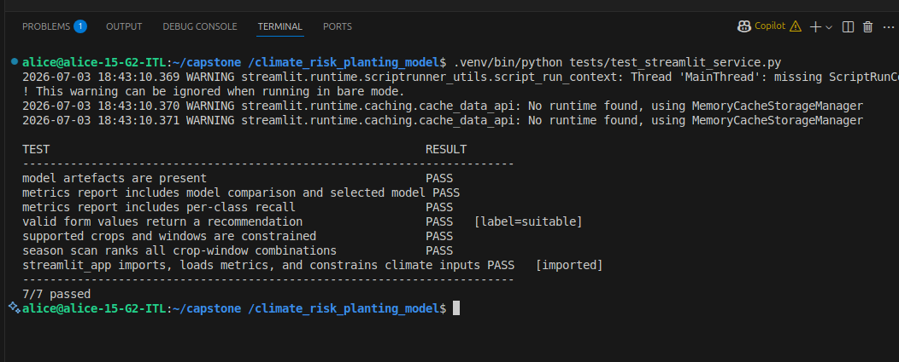
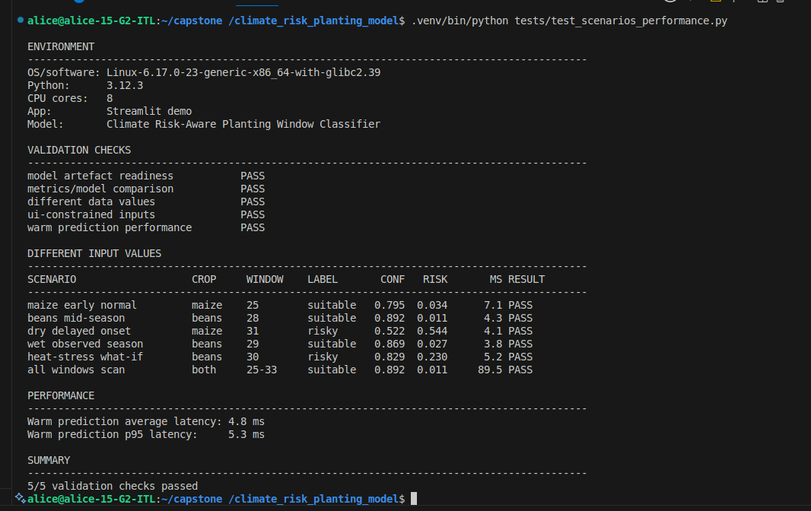
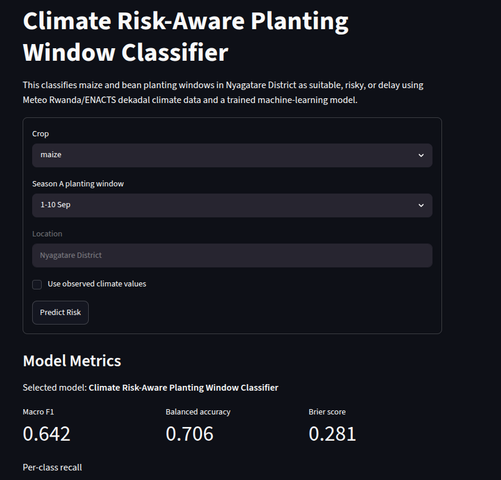
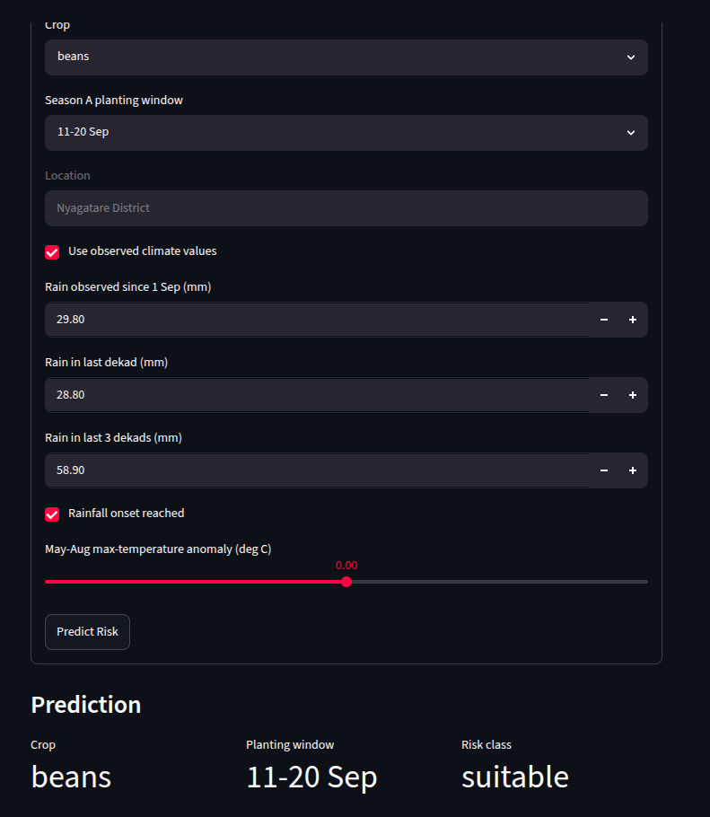
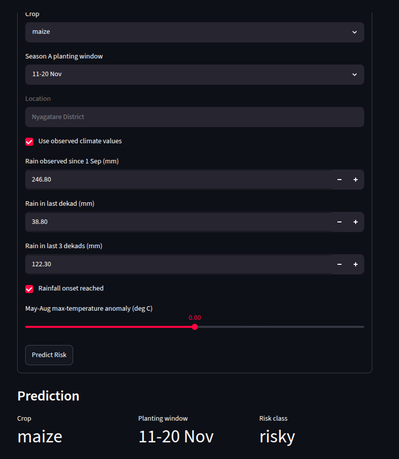
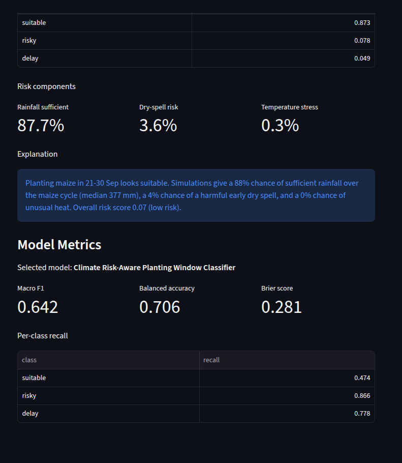
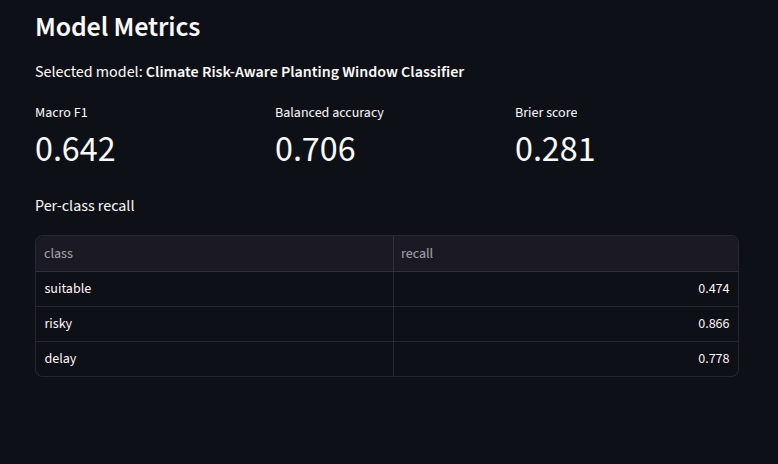

# Climate Risk-Aware Planting Window Classifier

This capstone project is a **Streamlit decision-support app** for classifying
maize and bean planting windows in Nyagatare District as **suitable**,
**risky**, or **delay** using Meteo Rwanda/ENACTS dekadal climate data and a
trained machine-learning model.

> **GitHub repo:** https://github.com/alicemukarwema/climate_risk_planting_decision_model  
> **Deployed Streamlit app:** https://climateriskplantingdecisionmodel-mqfkjhaejf5e9fk5q8slgt.streamlit.app/  
> **5-minute demo video:** https://drive.google.com/file/d/1trDtNwObJ4aEENOfXE2WRl2Xh8jfeOKN/view?usp=sharing

## Product Scope

The app answers one focused question:

```text
For a selected crop and planting window in Nyagatare, is the climate risk
suitable, risky, or high enough that planting should be delayed?
```

Implemented functionality:

- Crop selection for maize and beans
- Season A planting-window selection from September to November
- Optional observed climate inputs for rainfall onset, recent rainfall, and
  pre-season temperature anomaly
- Risk classification into suitable, risky, or delay
- Class probabilities for all three risk classes
- Rainfall sufficiency, dry-spell risk, and temperature-stress indicators
- Plain-language explanation for the recommendation
- Model metrics shown inside the Streamlit demo

The model is an academic decision-support prototype. It is not guaranteed
farmer-facing agronomic advice and should be validated with local agronomists,
RAB, Meteo Rwanda, and extension officers before operational use.

## Install And Run

Requires **Python 3.11+**.

```bash
git clone https://github.com/alicemukarwema/climate_risk_planting_decision_model
cd climate_risk_planting_decision_model
```

Create and activate a virtual environment.

Windows:

```bat
python -m venv .venv
.venv\Scripts\activate
```

Mac/Linux:

```bash
python3 -m venv .venv
source .venv/bin/activate
```

Install dependencies:

```bash
pip install -r requirements.txt
```

Run the Streamlit app:

```bash
streamlit run streamlit_app.py
```

If model artefacts need to be refreshed:

```bash
python train.py
```

On Linux/macOS where `python` is not available, use `python3` or
`.venv/bin/python` for the same commands.

## Related Files

```text
streamlit_app.py                 Main Streamlit demo interface
train.py                         Training entry point
src/                             Data loading, feature engineering, simulation,
                                 modelling, recommendations, and service logic
data/                            ENACTS climate extracts and generated tables
models/xgb_planting_risk.json    Saved selected model
models/report.json               Model comparison and evaluation metrics
notebooks/nyagatare_model.ipynb  Executed modelling notebook
tests/test_streamlit_service.py  Streamlit/service smoke tests
tests/test_scenarios_performance.py Scenario and performance checks
docs/                            Dataset notes, model card, figures, label rules
```

## Dataset And Model

The dataset uses Meteo Rwanda/ENACTS dekadal climate extracts for Nyagatare:

- `data/nyagatare_rainfall_dekadal.csv`
- `data/nyagatare_tmax.csv`
- `data/nyagatare_tmin.csv`

Each modelling row represents:

```text
one year x one crop x one candidate planting window
```

The target classes are `suitable`, `risky`, and `delay`. Labels are proxy
agronomic risk labels created from rainfall, dry-spell, and temperature
thresholds. They are not measured yield labels.

The final model combines climate features, Markov-chain/Monte-Carlo stochastic
risk features, and an XGBoost multi-class classifier.

## Model Results

Temporal hold-out evaluation:

- Training years: 1982-2014
- Test years: 2015-2023

| model | macro F1 | balanced accuracy | Brier score |
|---|---:|---:|---:|
| Rule-based baseline | 0.320 | 0.340 | 0.534 |
| Decision Tree - raw climate | 0.463 | 0.542 | 0.462 |
| Decision Tree - stochastic risk | 0.526 | 0.632 | 0.468 |
| XGBoost - all features | 0.642 | 0.706 | 0.281 |

Selected XGBoost per-class recall:

| class | recall |
|---|---:|
| suitable | 0.474 |
| risky | 0.866 |
| delay | 0.778 |

## Testing

Run the Streamlit/service smoke tests:

```bash
.venv/bin/python tests/test_streamlit_service.py
```

Latest local result:

```text
model artefacts are present                             PASS
metrics report includes model comparison and selected model PASS
metrics report includes per-class recall                PASS
valid form values return a recommendation               PASS
supported crops and windows are constrained             PASS
season scan ranks all crop-window combinations          PASS
streamlit_app imports, loads metrics, and constrains climate inputs PASS
7/7 passed
```

Run the scenario and performance checks:

```bash
.venv/bin/python tests/test_scenarios_performance.py
```

Additional checks covered:

| check | coverage |
|---|---|
| Functional smoke testing | Streamlit imports, model artefacts load, metrics load, prediction returns all required fields |
| Different data values | Maize, beans, early/mid/late windows, wet season, dry delayed onset, heat-stress what-if |
| Edge/control testing | Streamlit inputs are constrained to supported crops, Season A windows, and numeric climate ranges |
| Model evaluation testing | Baseline, Decision Tree, stochastic-risk tree, and XGBoost metrics compared |
| Performance testing | Warm prediction latency measured after model/service startup |
| Deployment testing | Deployed Streamlit link and local Streamlit run command provided |

Validation screenshots:

**Streamlit service smoke test**



**Scenario and performance checks**



**Streamlit overview and model metrics**



**Beans prediction with observed climate values**



**Maize risky prediction with observed climate values**



**Prediction explanation and risk components**



**Clean model metrics view**



Demo checklist:

- Streamlit app open on the deployed link
- Prediction result for maize in `1-10 Sep`
- Prediction result after changing crop/window/climate values
- Model metrics section in the Streamlit app
- Terminal output from the two test scripts above

## Deployment Plan And Execution

Primary deployment target: **Streamlit Community Cloud**.

Deployment steps:

1. Push the repository to GitHub.
2. Open Streamlit Community Cloud and create a new app from this repo.
3. Set the main file path to `streamlit_app.py`.
4. Use `requirements.txt` for dependency installation.
5. Deploy and open the app URL.
6. Verify the app loads, model metrics appear, and at least two crop/window
   predictions return risk classes and explanations.

The submitted deployment link is:

```text
https://climateriskplantingdecisionmodel-mqfkjhaejf5e9fk5q8slgt.streamlit.app/
```

No separate API server, Docker deployment, or Render service is required for
the submitted version. The app is connected to Streamlit through
`streamlit_app.py`.

Inside `streamlit_app.py`, the app loads the trained model through
`AdvisoryService` in `src/service.py`. That service reads the climate data,
loads `models/xgb_planting_risk.json`, reads metrics from `models/report.json`,
and returns predictions to the Streamlit form.

## Analysis

The project achieved the main proposal objective: a working climate-risk-aware
planting-window classifier for maize and beans in Nyagatare. The selected
XGBoost model improved over the rule-based baseline, especially on balanced
accuracy and Brier score, showing that combining raw climate features with
stochastic risk features gives more useful predictions than fixed rules alone.

The strongest operational result is recall for the riskier classes:
`risky` recall is 0.866 and `delay` recall is 0.778. This matters because the
most harmful failure would be telling a user that a window is suitable when it
should actually be delayed. The lower `suitable` recall of 0.474 shows a
conservative tendency: the model sometimes avoids calling a window suitable.
For a decision-support prototype, this is acceptable, but it should be improved
with more local validation data before farmer-facing use.

## Discussion

The major milestones were important because each one reduced project risk:
cleaning the ENACTS data made the model reproducible, defining agronomic labels
made the ML task testable, adding stochastic simulation represented rainfall and
dry-spell uncertainty, and building the Streamlit app turned the model into a
demonstrable product rather than only a notebook result.

The impact is practical: supervisors, students, and extension stakeholders can
try different planting windows and immediately see the risk class, confidence,
and climate-risk explanation. The app also makes model limitations visible,
which is important for responsible use.

## Recommendations And Future Work

- Validate crop thresholds and labels with RAB, Meteo Rwanda, agronomists, and
  Nyagatare extension officers.
- Add more seasons, more districts, and more crops after validation.
- Compare predictions against farmer observations or yield outcomes when such
  data becomes available.
- Add updated climate data and retrain the model on a planned schedule.
- Improve the UI with supervisor feedback, especially clearer wording for
  non-technical users.
- Keep the app as decision support, not guaranteed advice, until it passes
  stakeholder validation.
